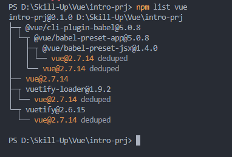
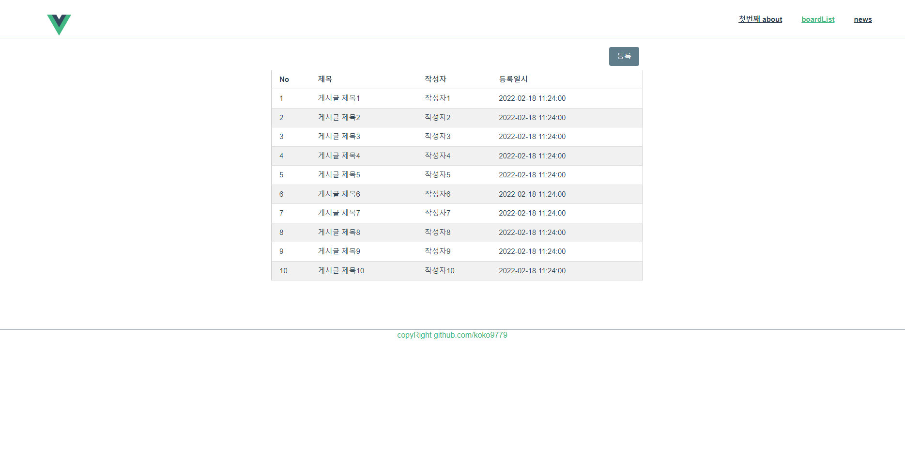
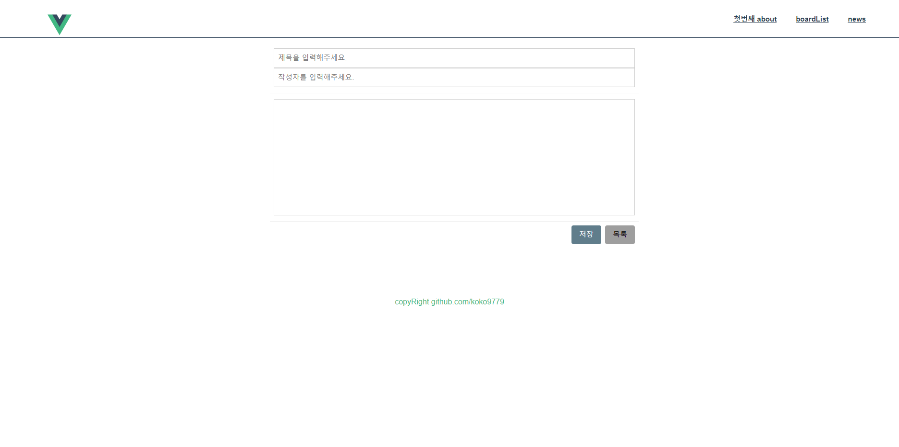
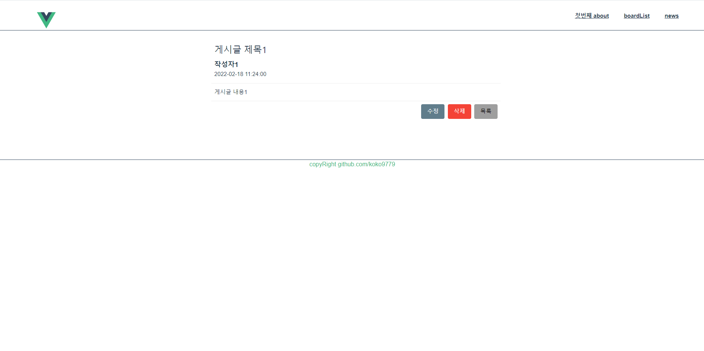

# intro-prj

> Vue.js 를 사용한 싱글 페이지 애플리케이션 구축 연습 프로젝트 

Vue 버전 : 2.7.14   



Tool : VS CODE

## Project setup
```
npm install
```

### Compiles and hot-reloads for development
```
npm run serve
```

### Vue 기본 문법과  기본 구조 익히기

| 디렉터리명/파일명 | 설명 |
| --------------- | ---- |
| assets | 정적파일/public한 파일 (ex.이미지) |
| components | 공통으로 사용되는 컴포넌트들을 넣어준다 |
| store | State를 선언해서 여러 컴포넌트들이 접근해 사용할 수 있게 하는 상태 관리 패턴 + 라이브러리  <br/> (vuex 라이브러리를 선택하면 생성되는 디렉터리) |
| views | Html 코드들과 Component로 구성된 사용자가 보이는 뷰들을 관리하는 폴더 |
| App.vue | 최상위 컴포넌트 | 
| main.js | <ul><li>애플리케이션 진입점으로 Vue 인스턴스를 생성하고 그 안에 router, store, 랜더링 할 vue를 설정 및 새로운 라이브러리를 설정할 수 있는 파일<li>import App 을 사용해 최상위 App.vue 컴포넌트 지정 실시</li><li>createApp mount를 사용해 index.html파일 div id 값 설정 및 렌더링 시작점 지정 실시</li></ul>|
| router.js | url 경로에 따라 컴포넌트를 매핑하는 곳  vue-router 인스턴스를 생성하고 mode와 routes속성 설정 |
| package.json | 프로젝트 정보 및 scripts, dependencies, devDependencies 등의 속성 명시한 파일| 
* 기본 문법 정리 소스 위치 /src/views/VueAbout.vue


### SPA 구조의 웹 에플리케이션을 위한 라우터(vue-router) 사용

    * 뷰 라우터란?
      vue.js 에서 페이지 이동을 위해 사용되는 라이브러리
      -> 페이지 이동을 할 때 url 이 변경되면, 변경된 요소의 영역에 컴포넌트 갱신

**설치방법(NPM)**

    npm install vue-router --save

### AXIOS를 사용해서 외부 API 데이터 끌어와보기

```
<script>
  const HOST = "";

  export default {
    methods: {
      getData() {
        this.$axios
          .get(HOST + "/api/getData")
          .then((res) => {
            console.log(res.staus);
            console.log(res.data);
          })
          .catch((error) => {
            console.log(error);
          })
          .finally(() => {
            console.log("항상 마지막에 실행");
          });
      },
    },
  };
</script>
```

axios.get / post / put / delete 을 사용해서 서버의 데이터를 불러오는 것을 요청할 수 있다.

**설치방법(NPM)**

    npm install axios

설치 이후 /node_modules에 axios가 추가된 것을 확인할 수 있다

### 간단한 게시판 만들어보기




#### 참조 
* [게시판 API 데이터 만들어서 테스트 해보기](https://github.com/koko9779/Skill-Up/tree/master/JPA/vue-backboard)
* [Vue.js 공식홈페이지](https://v2.ko.vuejs.org/v2/guide)
